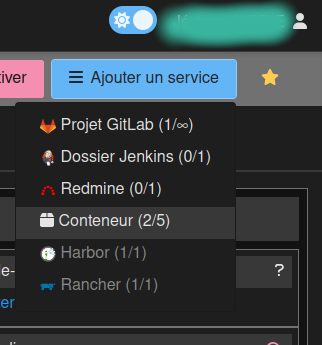

# How-to install a qualification environment

This document describes how to install a qualification environment for this project.

## 1. Add a container on wombat



Choose your name and domain. Use Debian 11, let hardware by default. Enable public access and secure by basic http auth.

## 2. Install tools

### 2.1. Update the system

```bash
# As root
apt update && apt upgrade -y
```

### 2.2. Install dependencies

```bash
# As root
apt install -y ca-certificates apt-transport-https software-properties-common curl wget lsb-release git rsync make
```

### 2.3. Install PHP

```bash
# As root

# First, import the GPG key and the Ondrej Sury repository
curl -sSL https://packages.sury.org/php/README.txt | bash -x
apt update && apt upgrade -y

# Install PHP 8.1
apt install php8.1 php8.1-fpm php8.1-cli -y

# Install PHP extensions
apt install php8.1-xml php8.1-pgsql php8.1-intl

# Check FPM
systemctl status php8.1-fpm

# Install composer
# Follow instruction on https://getcomposer.org/download/
# Set installation global
mv composer.phar /usr/local/bin/composer
```

### 2.4. Install Nginx

```bash
# As root
apt install nginx -y

# Check Nginx
systemctl status nginx
```

### 2.5. Install NodeJs

```bash
# As root

# First, import the GPG key and the Ondrej Sury repository
curl -sL https://deb.nodesource.com/setup_16.x | bash -
apt update && apt upgrade -y

# Install NodeJs
apt -y install nodejs

# Install Yarn
npm install --global yarn

# Check Node
node -v
yarn -v
```

### 2.6. Install Postgresql (Only if needed)

```bash
# As root
apt install postgresql postgresql-contrib -y

# Check Redis
systemctl status postgresql
```

### 2.7. Install Redis (Only if needed)

```bash
# As root
apt install redis-server -y

# Check Redis
systemctl status redis
```

### 2.8. Install PPEL Database (Only if needed)

```bash
wget https://dev.mysql.com/get/mysql-apt-config_0.8.25-1_all.deb
dpkg -i mysql-apt-config_0.8.25-1_all.deb
apt update
apt install php8.1-mysql mysql-community-server
mysql -uroot -p
> CREATE USER 'ppel'@'localhost' IDENTIFIED BY '<password>';
> CREATE DATABASE plainteinternet;
> GRANT CREATE, ALTER, DROP, INSERT, UPDATE, DELETE, SELECT, REFERENCES on plainteinternet.* TO 'ppel'@'localhost' WITH GRANT OPTION;
> FLUSH PRIVILEGES;
> exit
mysql -hlocalhost -uppel -p plainteinternet < /home/pel-agent/plaintes-en-ligne-pel/current/docker/ppel/setup_preplainte_historique.sql
```

### 2.9. Install ActiveMQ (Only if needed)

```bash
apt install default-jdk default-jre
wget https://dlcdn.apache.org//activemq/5.18.1/apache-activemq-5.18.1-bin.tar.gz
tar -xzvf apache-activemq-5.18.1-bin.tar.gz
mv apache-activemq-5.18.1 /opt/activemq
useradd -d /opt/activemq -r -s /bin/false -U activemq
chown -R activemq:activemq /opt/activemq/
# Copy the following into /etc/systemd/system/activemq.service
```

```ini
[Unit]
Description=Apache ActiveMQ
After=network.target

[Service]
Type=forking
User=activemq
Group=activemq
ExecStart=/opt/activemq/bin/activemq start
ExecStop=/opt/activemq/bin/activemq stop

[Install]
WantedBy=multi-user.target
```

```bash
systemctl daemon-reload
systemctl enable activemq
systemctl start activemq
```

## 3. Configuration

### 3.1. Generate user

```bash
adduser <unprivileged_user_name>
```

### 3.1. Nginx

```conf
# /etc/nginx/conf.d/<app_name>.conf
server {
    server_name <internal_vpn_smile_domain> <configurated_container_domain>;
    root /home/<container_user_name>/<app_name>/current/public;
    
    location / {
        try_files $uri /index.php$is_args$args;
    }
    
    location ~ ^/index\.php(/|$) {
        fastcgi_pass unix:/run/php/php8.1-fpm.sock;
        fastcgi_split_path_info ^(.+\.php)(/.*)$;
        include fastcgi_params;
        fastcgi_param APP_ENV prod;
        fastcgi_param SCRIPT_FILENAME $realpath_root$fastcgi_script_name;
        fastcgi_param DOCUMENT_ROOT $realpath_root;
        internal;
    }
    
    location ~ \.php$ {
        return 404;
    }
    
    error_log /var/log/nginx/<app_name>.error.log;
    access_log /var/log/nginx/<app_name>.access.log;
}
```

### 3.2. PHP

```conf
# /etc/php/8.1/fpm/pool.d/www.conf
# Change user and group by <unprivileged_user_name>
```

### 3.2. Postgresql

```conf
# Set password for postgres user
passwd postgres

# Set password for internal postgres user
su postgres
psql
ALTER USER postgres WITH PASSWORD '<new_password>';
```

### 4. Citoyen portal

### 4.1. Postgresql

```conf
# After referential db creation
su postgres
psql -d <referential_db>
create extension if not exists "unaccent";
```

### 5. Citoyen portal

### 5.1. Postgresql

```conf
# After db creation
su postgres
psql -d <app_db>
create extension if not exists "unaccent";
```
